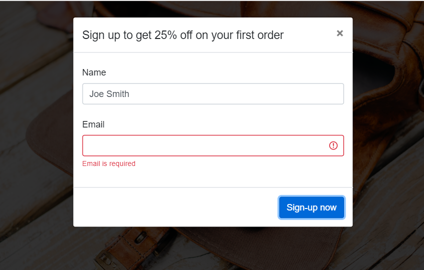

# Landing page signup banner

This is an example of a landing page banner with a sign-up form to collect leads.

## Example




## Getting started

* Clone this repo to your local machine using https://github.com/marynapl/landing-page-signup.git
```
git clone https://github.com/marynapl/landing-page-signup.git
```
* Open the solution file (LandingPageSignup.sln) in Visual Studio 2019
* Build and run the project

## Built with

* ASP.NET Web Application (.NET Framework), MVC, Web API
* Entity Framework
* LocalDB (for example purposes only)
* Bootstrap 4, JQuery

## License

This project is licensed under the MIT License.
